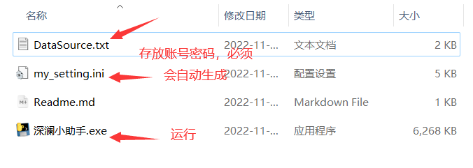
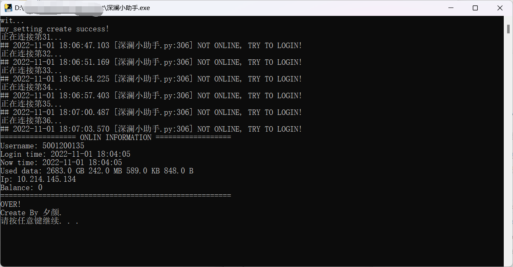

### 深澜小助手（方便我自己个人白嫖校园网）

---2023年3月23日16:39:25更新---
1. 增加起始点随机功能，避免单个同学被一直雷普（114？514！）；
2. 删除了无关代码，优化项目结构；
3. 代码合并到一个文件，可以取消fork力。


##### 声明：只是一个循环连接校园网的程序，不提供账号密码。


运行前确保release程序同目录下有“**DataSource.txt**”文件，如没有，请下载，否则程序得不到数据会崩溃。

格式是每行一个**账号+空格+密码**。








##### my_setting.ini一些参数的说明：

```in
[Description] 描述信息
totalnumber = 61    表示有多少组账号密码
defaultstart = 31   表示从哪开始尝试连接
randomstart = True  默认从随机处开始连接
```


